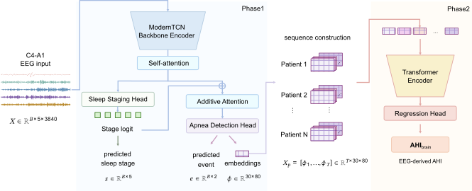

# BrainAHI

**The EEG-Respiratory Gap: An Interpretable Biomarker of the Brain's Respiratory Burden in Obstructive Sleep Apnea**

This repository contains the training and inference code for BrainAHI, a two-phase deep-learning framework that estimates a patient-level, EEG-derived apnea-hypopnea index (AHI<sub>brain</sub>) from a single-channel sleep EEG. Phase 1 learns epoch-level sleep-stage and respiratory-event representations from 30-second EEG segments; Phase 2 aggregates these representations into a single patient-level AHI<sub>brain</sub> estimate. The gap between AHI<sub>brain</sub> and the polysomnography-derived ground-truth AHI is summarized by two derived metrics reported in the manuscript, ΔAHI<sub>brain</sub> and AHI<sub>brain,event-free</sub>.



## Installation

The code was developed with Python 3.11 and PyTorch 2.5.1 (CUDA 12.1).

```bash
pip install torch==2.5.1 --index-url https://download.pytorch.org/whl/cu121
pip install -r requirements.txt
```

## Data

Raw polysomnography (PSG) data are not included in this repository.

- KISS: [NIA AI Hub](https://aihub.or.kr) (controlled access)
- MESA, MrOS, SHHS: [National Sleep Research Resource (NSRR)](https://sleepdata.org)

Each provider requires separate approval and its own data-use agreement.

Phase 1 expects a central C4-A1 EEG channel, resampled to 128 Hz, segmented into 30-second epochs, and represented as five frequency-band input channels per epoch. The upstream preprocessing that produces this format from raw EDF recordings is not included in this repository.

## Usage

### Phase 1

Phase 1 (`run.py`) trains a ModernTCN-based multi-task model that jointly performs sleep staging and respiratory-event detection on 30-second EEG epochs.

```bash
python run.py \
    --task_name classification --is_training 1 \
    --model MultiTask --data MULTICENTER --dataset_name kiss --model_id <MODEL_ID> \
    --root_path <DATA_ROOT> --data_path <DATA_ROOT>/eeg_bands/ \
    --label_30s_path <DATA_ROOT>/labels/all_labeled_30s.csv --label_1s_path <DATA_ROOT>/labels/ \
    --train_centers_json <CONFIG_DIR>/train_centers.json \
    --val_centers_json <CONFIG_DIR>/val_centers.json \
    --test_centers_json <CONFIG_DIR>/test_centers.json \
    --checkpoints <CHECKPOINT_DIR> \
    --seq_len 3840 --patch_size 128 --patch_stride 16 \
    --num_blocks 1 1 1 1 --large_size 63 31 15 7 --small_size 11 9 7 5 --dims 64 64 64 64 \
    --learning_rate 0.001 --batch_size 512 --train_epochs 30 --patience 7
```

### Phase 2

Phase 2 (`exp/train_phase2_log.py`) trains a Transformer encoder that aggregates a patient's Phase 1 epoch-level features into a single patient-level AHI<sub>brain</sub> estimate.

```bash
cd exp
python train_phase2_log.py \
    --model_id <MODEL_ID> --checkpoints <CHECKPOINT_DIR> --model_type tfm \
    --train_epochs 50 --batch_size 1 --learning_rate 5e-4 --patience 10
```

### Inference

AHI<sub>brain</sub> is produced by running Phase 1 feature extraction (`run.py --extract_features 1`) followed by Phase 2 inference (`exp/test_phase2_log.py`):

```bash
python run.py --task_name classification --is_training 0 --extract_features 1 \
    --model MultiTask --data MULTICENTER --dataset_name kiss --model_id <MODEL_ID> \
    --checkpoints <CHECKPOINT_DIR>

cd exp
python test_phase2_log.py --model_id <MODEL_ID> --checkpoints <CHECKPOINT_DIR> \
    --dataset_name <DATASET_NAME> --model_type tfm --test_mode all
```

AHI<sub>brain,event-free</sub> is obtained by running the same inference with `--test_mode clean`, which restricts each patient's input to epochs without a predicted respiratory event before Phase 2 inference.

ΔAHI<sub>brain</sub> is computed in downstream analysis (regression of AHI<sub>brain</sub> on ground-truth AHI); that analysis code is not part of this repository.

## Citation

Citation information will be updated upon publication.

## License

The license for this repository has not yet been determined.

## Contact

`<CONTACT_NAME>` — `<CONTACT_EMAIL>`
